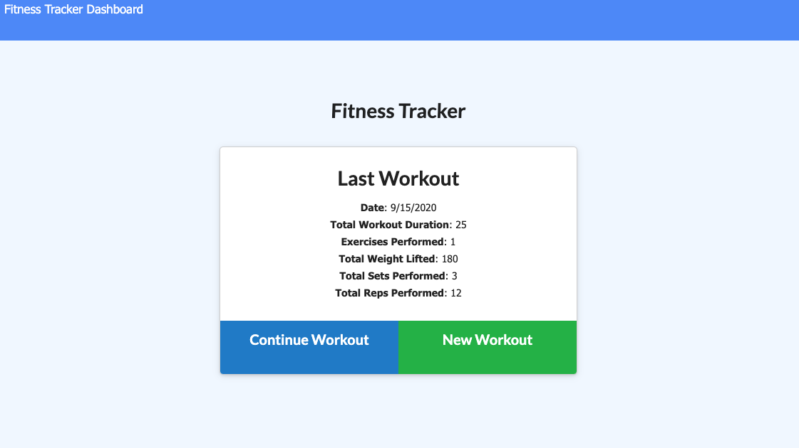
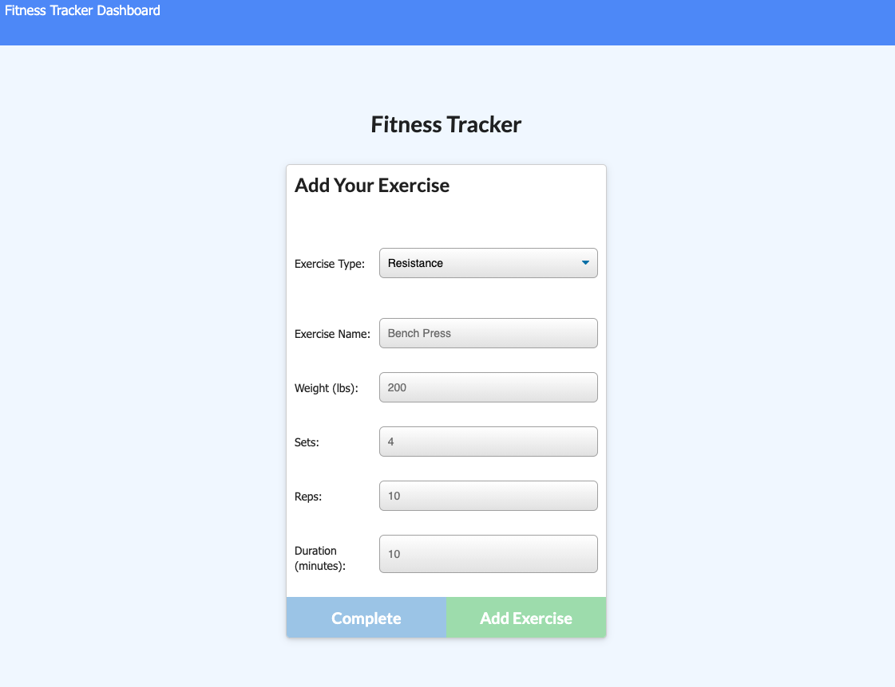
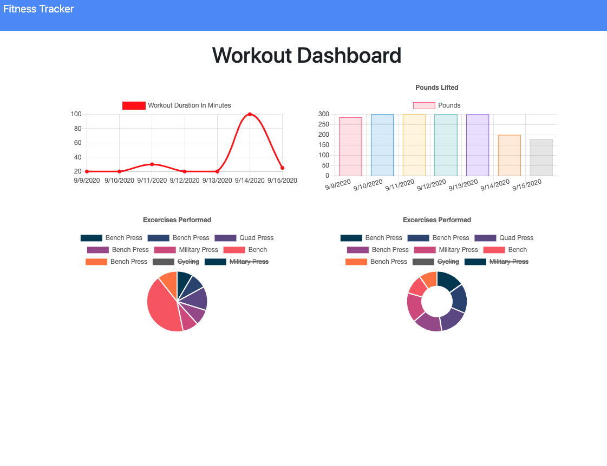

# Workout Tracker (Node JS and MongoDB)

A workout tracker: Intended to help athletes and non-athletes to work for their fitness and training goals.

## User Story

* As a user, I want to be able to view create and track daily workouts. I want to be able to log multiple exercises in a workout on a given day. I should also be able to track the name, type, weight, sets, reps, and duration of exercise. If the exercise is a cardio exercise, I should be able to track my distance traveled.

## Business Context

A consumer will reach their fitness goals quicker when they track their workout progress.

## Technologies 

1. **Node JS**
2. **MongoDB**
3. **Mongoose**
4. **Express**

## Instructions

Clone this repo and follow these steps:
- run npm install (install dependencies)
- Ensure you have Mongo installed and server up anr running.
- This app comes equipped with a DB Seeder that will connect to the DB and pre-load some sample data.
- in Dev Env. app wil run at http://localhost:8080 (the port could be change in the server.js file)

## Deployed App (Heroku + Mongo Atlas) 

* [Heroku Link](https://nameless-journey-77779.herokuapp.com/)

App Home Page:
- App home page loads information of last workout stored in DB and allows the user to either add an exercise to that workout or to start a new one.

Continue or New workout view:
- Select exercise type and fill in the information to register a new exercise.

Stat Dashboard:
- Graphs are provided to see the progress of the last 7 days.

## Contributing

1. Ariel Cuesta

## Tests

Testing has not been incorporated at the moment.

## License

MIT

## Questions

Want to get in touch? Github: arielcc88
Report bugs and enhancements to: arielcc88@gmail.com
